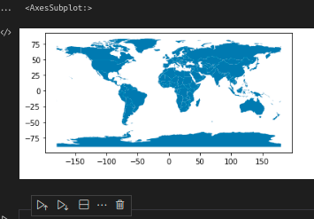

# An opinionated technique of transfering shapely(GEOS based) geometries through gRPC in python

In gRPC, the client and the server communicate through a strict schema defined in a .proto(protobuf format).
The client and the server send each other messages, which are what the blueprints which determine the fields that the generated classes will have.

gRPC has support for many of the primitives we use in programming e.g strings, integers, booleans, map<k,v>,enums whic you can use directly. 

The challenge with geospatial data is it that it comes in various formats(Points,Linestring,Polygon, MultiGeometries) which are obviously not supported in gRPC.

This package attempts to have a go at transmission of geos-based geometries(shapely primitives) through gRPC in an efficient* manner through creating creating custom serializers and deserializers which convert from Shapely geometries to protobuf(Generated classes) and back. 

> The reason I say efficient is I once made a wkt server, but the performance wasn't good in transferring large geometries.

## Countries Example
Let's say you want to create a gRPC web service where 
1. a client can request for countries(All countries of the world) 
2. a client can search for countries by name
3. a client can filter countries which intersect with some boundary. 

In gRPC, we can define the service as 
```protobuf
// earth_service.proto
syntax = "proto3";

import "geometry.proto";

service EarthService {
    rpc GetAllCountries(GetAllCountriesRequest) returns (Countries);
    rpc SearchCountries(SearchCountriesRequest) returns (Countries);
    rpc GetCountriesInBoundary(GetCountriesInBoundaryRequest) returns (Countries);
}

message Country {
    string code = 1;
    string name = 2;
    // we can use wkt here, but grpc prefers small-repeated messages
    geometry.Geometry geometry = 3;
    string type = 4;
}

message Countries {
    // this maps to a list
    repeated Country countries = 1;
}

message GetCountriesRequest {
    string message = 1;
}

message GetCountriesInBoundaryRequest {
    geometry.Geometry boundary = 1;
}

message SearchCountriesRequest {
    string keyword = 1;
}

```

Having our service defined, we will use Natural earth data in this example and geopandas to easily create the service

```python
url = 'https://www.naturalearthdata.com/http//www.naturalearthdata.com/download/110m/cultural/ne_110m_admin_0_countries.zip'

#!pip install wget
import wget
# download countries_data set
filename = wget.download(url)

import geopandas as gpd
# read downloaded file
gdf = gpd.read_file(filename,columns=cols)

gdf = gdf[['TYPE','ADMIN','geometry','ADM0_A3']]

gdf.head()
```

Subset of countries in our natural earth dataset

From the screenshot above, you see that the data has a mix of polygon and multipolygons but that should not be a problem for us when using this service. We have a `Geometry` message which can transmit store data about any shapely Geometry type.


### Implementing the gRPC Earth Service
This assumes some familiarity with gRPC. If you haven't used it before, I cannot recommend it enough(https://grpc.io/docs/languages/python/quickstart/)

In gRPC, we use code-generation to create the stub/sdk which the clients(in any language) will use to communicate to our service and abstract servicer classes which we'll implement according to our needs.
Running the code below generates two files `earth_service_pb2_grpc.py` that contains abstract classes which we'll have to implement in our service handler and `earth_service_pb2`  which contains the generated python objects that map to and fro protobuf

```bash
# code to generate our stubs
python -m grpc_tools.protoc -I example/countries/ --python_out=example/countries/ --grpc_python_out=example/countries/ example/countries/earth_service.proto
```

```python
# server.py
# This is how to implement a server that serves the EarthService we created in our earth_service.proto
from earth_service_pb2_grpc import EarthServiceServicer
from earth_service_pb2 import Countries,Country
import geopandas as gpd

class EarthService(EarthServiceServicer):

    def __init__(self,countries_fp) -> None:
        gdf = gpd.read_file(countries_fp)
        self.gdf = gdf[['TYPE','ADMIN','geometry','ADM0_A3']]
        self.gdf = gpd.read_file(countries_fp)


    def GetAllCountries(self, request, context):
        return rows_to_countries(self.gdf)

    def SearchCountries(self, request, context):
        filter = request.keyword
        subset = self.gdf.loc[self.gdf['ADMIN'].str.contains(filter)]
        return rows_to_countries(subset)

    def GetCountriesInBoundary(self, request, context):
        bounds = request.boundary
        shapely_bounds = deserialize_protobuf_geometry(bounds)
        subset = self.gdf.loc[self.gdf.geometry.intersects(shapely_bounds)]
        return rows_to_countries(subset)
```
Using a geopandas dataframe, filtering and other spatial operations have been abstracted for us. 
We also create a helper method `row_to_countries` which takes a GeoDataFrame and returns `Countries` object which can be serialized over the network as protobuf.

# Deserialization and Serialization of Geometries
This python package uses shapely since it implements the C++ libgeos specification on geometries. The example above uses geopandas which also uses shapely under the hood to handle geometries.

## A protobuf format for any geometry

In Geospatial, we have geospatial primitives(Points,Lines,Polygons,MultiGeometries etc) as listed in the Type enum in the protobuf below. Using the Geometry format below, we can store abitrarily any Geospatial data type using the format below, serialize it to protobuf and back consistently. The inspiration for the message format below came from a 52North Java Implementation and where the original project idea came from https://github.com/52North/topology-serialization-framework. The Java Implementation has serializers and deserializers that mapped JTS Geometries to protobuf and back. Which is also what this project simply does.

```protobuf
message Coordinate {
    double x = 1;
    double y = 2;
    double z = 3;
    bool has_z = 4; //protobuf serialization defaults to 0 for undefined values.
}

message Geometry {
    Type type = 1;
    repeated Coordinate coordinates = 2;
    repeated Geometry geometries = 3;
}

enum Type {                                                             
    POINT = 0;
    LINESTRING = 1;
    POLYGON = 2;
    MULTIPOINT = 3;
    MULTILINESTRING = 4;
    MULTIPOLYGON = 5;
    LINE = 6;
    TRIANGLE = 7;
    LINEARRING = 8;
    GEOMETRYCOLLECTION = 9;
}
```
To serialize any shapely [BaseGeometry](https://shapely.readthedocs.io/en/stable/manual.html) into protobuf, simply create an instance of ShapelyGeometrySerializer and call .serialize(geometry: BaseGeometry) and return that object to the grpc service handler for transmission to the client/server. Since all shapely primitives are generated from BaseGeometry, any type can be serialized and deserialized.

Once generated, copy the file [serializers.py](shapely_grpc_io/serializers.py) to the same folder as the generated files exist.

```python
# import the ShapelyGeometrySerializer from this package
from serializers import ShapelyGeometrySerializer
serializer = ShapelyGeometrySerializer()

def row_to_country(row):
    return Country(
        name=row['ADMIN'],
        type=row['TYPE'],
        # the line below serializes shapely geometries to protobuf-mappable classes
        geometry=serializer.serialize(row['geometry']),
        code=row['ADM0_A3'],
    )

def rows_to_countries(gdf):
    return [row_to_country(row) for idx,row in gdf.iterrows()]
```
With that we have a fully functioning server ready to accept and server requests.

## Serialization

So say a client sends a request which contains the Geometry message, we'll need to deserialize that to a shapely geometry so that we can use with other geospatial packages depending on your usecase.

There is a `ShapelyPBDeserializer` class that can handle deserialization from Geometry in protobuf format to shapely primitives.

```python
from shapely_grpc_io.shapely_deserializer import ShapelyPBDeserializer
deserializer = ShapelyPBDeserializer()

def deserialize_protobuf_geometry(serialized_geometry):
    geometry = deserializer.deserialize(serialized_geometry)
    return geometry # returns a shapely geometry
```

Now you can take the deserializd_geometry and do things like buffering, intersections, save it in a PostGIS database etc. In our case, we're passing it to geopandas to check which countries the specified boundary intersects with.

To run the gRPC server, we create a main method like below

```python
from concurrent import futures
import grpc
import os

def _serve(port):
    server = grpc.server(futures.ThreadPoolExecutor())
    # Download the natural earth dataset and inject into EarthService
    filename = 'ne_110m_admin_0_countries.zip'
    if not os.path.exists(filename):
        import wget
        url = "https://www.naturalearthdata.com/http//www.naturalearthdata.com/download/110m/cultural/ne_110m_admin_0_countries.zip"
        # download countries_data set
        filename = wget.download(url)

    add_EarthServiceServicer_to_server(
        servicer=EarthService(filename),
        server=server,
    )

    bind_address = f"[::]:{port}"
    server.add_insecure_port(bind_address)

    server.start()
    logging.info("Listening on %s.", bind_address)
    server.wait_for_termination()


if __name__ == "__main__":
    logging.basicConfig(level=logging.INFO)
    _serve(8080)
```

## Making requsts to the server
The good thing about gRPC is we have client stubs that allow us to interact with the server. In our example, the generated python stub is called EarthServiceStub found in the generated `earth_service__pb2_grpc.py`.
What we need to do is configure a client_channel pointing the address and port of the running server.

```python
channel = grpc.insecure_channel("localhost:8080") # running at localhost port 8080
client_stub = EarthServiceStub(channel)
```

#### GetAllCountries

```python
import grpc
from earth_service_pb2_grpc import EarthServiceStub
from earth_service_pb2 import GetAllCountriesRequest

channel = grpc.insecure_channel("localhost:8080")
client_stub = EarthServiceStub(channel)

all_countries = client_stub.GetAllCountries(
    GetAllCountriesRequest(
        message="Hello server",
    )
)

print(len(all_countries.countries)) # prints 177

```
Once we have got a response, which is a countries object, we the data format in countries.countries is in protobuf format. We need to deserialize it into python shapely geometries.
```python
from serializers import ShapelyPBDeserializer,ShapelyGeometrySerializer
deserializer = ShapelyPBDeserializer()
```

For this example, we'll create a GeoSeries object to enable basic plotting as in the code below
```python
from geopandas import GeoSeries # can hold a list of geometries

# use deserializer to deserialize into shapely geometries
country_geometries = [deserializer.deserialize(country.geometry) for country in all_countries.countries]

#create a GeoSeries object containing geomtries of all countries and plot the result
geoserie = GeoSeries(country_geometries)
geoserie.plot()
```
The result we get is all countries as expected



##### Since we'll use GeoSeries throughout this to handle the response, let's create a helper function to return GeoSeries of countries we get as response

```python
from serializers import ShapelyPBDeserializer,ShapelyGeometrySerializer
from geopandas import GeoSeries

deserializer = ShapelyPBDeserializer()

def geo_series_from_countries(countries):
    country_geometries = [deserializer.deserialize(country.geometry) for country in countries.countries]


    geoserie = GeoSeries(country_geometries)
    return geoserie
```

### SearchCountries

Another part the server was supposed to handle was searching countries by name.

```python
filtered_countries = client_stub.SearchCountries(
    SearchCountriesRequest(
        keyword="A",
    )
)
names = [c.name for c in filtered_countries.countries]
print(','.join(names))

a_geoserie = geo_series_from_countries(filtered_countries)
a_geoserie.plot()
```
##### Output
###### 'United States of America,Argentina,French Southern and Antarctic Lands,South Africa,Central African Republic,Angola,Algeria,United Arab Emirates,Afghanistan,Armenia,Austria,Albania,Australia,Azerbaijan,Saudi Arabia,Antarctica'

The result we get is a subset of the countries containing capital 'A'


### Countries intersecting some boundary
The purpose of this example is to show how to send shapely geometries to the server.

For this example, I created a boundary that spans Middle-East and the horn of Africa.


```python
from shapely.geometry import Polygon

pts = [
    [22.67578125, 33.7243396617476],
    [30.41015625, 6.315298538330033],
    [60.29296874999999, -2.108898659243126],
    [68.73046875, 18.812717856407776],
    [60.99609375, 33.7243396617476],
    [40.60546875, 41.77131167976407],
    [22.67578125, 33.7243396617476],
]
polygon = Polygon(pts)
polygon

# serialize polygon to geometry compatible format
bounds = serializer.serialize(polygon)
```
Since we have serialized the bounds to the specified format in the message, we can send a request to the server

```python
within = client_stub.GetCountriesInBoundary(GetCountriesInBoundaryRequest(boundary=bounds))

geoserie_within_boundary = geo_series_from_countries(within)
geoserie_within_boundary.plot()
```

The result is as follows


That's all for this example. If you want to play along with these examples, I've created a notebook [client example](example/countries/client.ipynb) which you can use to experiment with.


I'd like to thank https://github.com/malithd and [52North](https://github.com/52North/) for creating the original message format definition. I was so shocked to find how a simple recursion and message format can store a Geospatial Data format of any kind.(AFAIK)

## Challenges

1. One has to copy the [serializers.py](shapely_grpc_io/serializers.py) and the [geometry.proto](example/countries/geometry.proto) file into every project you create. If you have an alternative way of handling this or even how to make it a package, kindly share an approach of how that could be done.
2. Every client/server in another language needs to implement the serialization/deserialization logic. It's not hard though. There is a [Java implementation](https://github.com/52North/topology-serialization-framework) which uses [JTS](https://github.com/locationtech/jts) and a [Dart implementation](https://github.com/bettdouglas/dart_jts_protobuf_io) which uses [Dart JTS](https://pub.dev/packages/dart_jts)